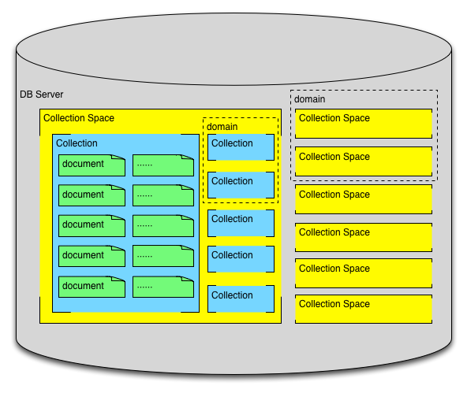
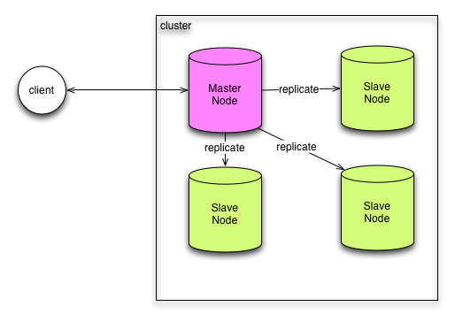

# SequoiaDB Node.js驱动设计文档

------

## 引言
本文档为SequoiaDB数据库的Node.js驱动的设计文档，主要描述客户端驱动的架构设计及部分细节描述。

## 术语

### SequoiaDB自有术语
- `SequoiaDB`，广州巨杉软件开发有限公司开发的新型NoSQL数据库软件。
- `SequoiaDB服务`，一个运行着的SequoiaDB数据库实例，基于TCP协议上的SequoiaDB自有应用层协议对外提供服务。
- `User`，用户。每个SequoiaDB中可以存在多个用户，每个客户端需要通过用户信息来连接SequoiaDB服务。
- `Connection`，连接。客户端与SequoiaDB服务之间建立的TCP连接。
- `CollectionSpace`，集合空间，SequoiaDB独有的概念。可以对应于MySQL中的数据库的概念。每个SequoiaDB服务中可以创建多个集合空间。
- `Collection`，集合。类似关系型数据库中的表，或者MongoDB中的Collection。每个集合空间中可以存在多个集合。
- `Document`，文档。类MongoDB中的文档，其本质就是对象。可以通过BSON或者JSON来具体表达。
- `Index`，索引。在集合上创建的索引。与其他数据库的索引作用相同。
- `Transaction`，事务。NoSQL数据库一般没有事务的设计，SequoiaDB将关系型数据库的特点引入NoSQL领域。通过事务可以对数据操作进行事务处理，具体视情况进行提交或回滚。
- `Cursor`，游标。对SequoiaDB服务进行列表（多个数据）查询时所使用到的工具。其原因是SequoiaDB在大数据量时并不一次性返回所有的数据到客户端，而是返回一个游标给调用方，调用方需要通过游标来逐个获取元素，并判断是否所有元素被返回。
- `Lob`，大对象。SequoiaDB可以在数据中存放文件类的大对象。MongoDB中的Binary JSON格式本事支持二进制数存储，只是存在稳定性的相关问题，所以不被建议使用，SequoiaDB在这里具有创新。
- `Domain`，域。可以将集合或者集合空间划分在某个域中。
- `Node`，SequiaDB服务集群的节点。通常指单个数据库服务节点。
- `Master`，SequiaDB服务集群的主节点。
- `Slave`，SequiaDB服务集群的从节点。
- `ReplicaGroup`，复制组。复制组下的节点可以从Master节点同步数据。
- `ReplicaCataGroup`，复制目录组。
- `Snapshot`，快照。
- `Task`，任务。
- `Backup`，备份。可以备份整个数据库或者指定的复制组。

### Node.js驱动相关术语
- `Node.js`，由Ryan Dahl开发的，基于V8引擎构建的非阻塞I/O模型、事件驱动的运行时环境。目前由Node.js基金会管理，主要特征有：单线程、异步I/O、JavaScript等。其具有轻量、高性能、开发效率高、开发者基数大等优点。
- `sequoia`，也就是本文重点要描述的SequoiaDB驱动，采用Node.js编写，基于SequoiaDB的通信协议与SequoiaDB服务建立连接，业务逻辑通过该客户端进行操作。
- `Pool`，连接池。
- `Parser`，协议解析器。

## 架构设计
### 纯JavaScript解析
通过调研，原始的C/C++驱动中对网络I/O的调用主要是通过同步的方式来进行的。这对Node.js来说会造成主线程的阻塞，如果通过JavaScript binding的形式来进行调用，会导致其他代码无法得到执行。根据调研C#驱动和Python驱动都是采用同步I/O的方式进行调用，这主要与主流社区都依然喜欢同步I/O的方式有关（性能上有损耗）。

解决的办法有两种，一种是修改C/C++代码，采用libuv的API进行重写，使得所有I/O调用进入事件循环；另一种是直接使用Node.js提供的上层API。通过libuv的API来编写依然要写JavaScript binding代码，并且也要提供一层wrapper，总体来说不仅要写大量的C/C++代码，还有不少的JavaScript代码。

通过调研C#驱动的实现，觉得通过纯JavaScript来实现网络协议是可行的。

### SequoiaDB单机架构

### SequoiaDB集群架构

### 客户端设计

### 连接池设计
连接池设计，任何对数据库的调用都是通过连接池获取连接，然后进行数据发送。接收完数据后，归还连接到连接池。

### 连接/协议解析器设计
每个连接的数据发送通过不同的方法封装二进制数据，从DB服务接收到的数据通过协议解析器将二进制数据重新解析为对象。

协议解析器通过有限自动机的方式来进行实现识别。通过识别消息长度，再截取指定长度的数据进行解析。

数据解析方面，如果接收到对象，通过bson模块进行解析。发送时也通过bson模块进行对象的序列化。

## API设计
驱动主要包含CollectionSpace、Collection、User、Transaction、Connection、Connection Pool、Document、Lob、Domain、Node、ReplicaGroup、Cursor的定义。

但是对外暴露的API中，只有Client是对外暴露的。Client封装了连接池的操作，具体连接交给Connection类来进行实现。

### 接口
接口以Callback的方式进行实现，在此基础上提供Promise的封装。以此可以方便的与ES5和ES6的代码进行兼容。
